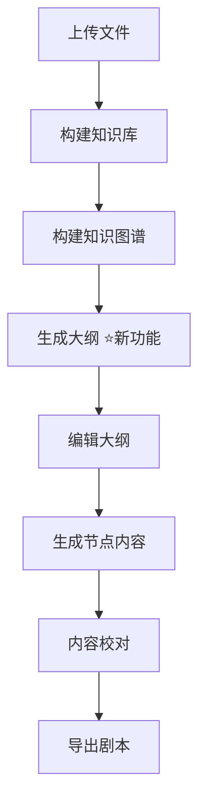

# 大纲生成功能开发完成通知

## 开发概述

✅ **已完成**: 剧本大纲生成功能（基于GraphRAG）

🕒 **开发时间**: 2025-10-28

👨‍💻 **开发内容**: 后端完整实现

## 新增功能

### 核心功能
实现了基于GraphRAG的剧本大纲自动生成。系统能够：
1. 读取知识库的实体（entities）、关系（relationships）和社区（communities）数据
2. 使用精心设计的提示词模板引导大模型
3. 自动生成符合规范的树状结构大纲
4. 保存到项目目录供后续使用

### API端点
```
POST /api/v1/generate/outline
```

输入：知识库名称
输出：结构化的JSON大纲

## 文件清单

### 新增文件（共7个）

#### 后端代码
1. `backend/app/services/outline_generation_service.py` - 核心服务
2. `backend/app/models/generation_models.py` - 数据模型
3. `backend/test_outline_generation.py` - 测试脚本

#### 文档
4. `OUTLINE_GENERATION.md` - 功能详细说明
5. `FRONTEND_INTEGRATION.md` - 前端集成指南
6. `IMPLEMENTATION_SUMMARY.md` - 实现总结
7. `QUICKSTART.md` - 快速入门指南

### 修改文件（共1个）

1. `backend/app/api/v1/rag.py` - 添加大纲生成API端点

## 快速使用

### 前提条件
```bash
# 1. 设置API密钥
set DASHSCOPE_API_KEY=your_key

# 2. 确保知识库已构建知识图谱
```

### 测试运行
```bash
# 使用测试脚本
cd backend
python test_outline_generation.py twin_pagoda

# 或使用API
curl -X POST "http://localhost:8000/api/v1/generate/outline" \
  -H "Content-Type: application/json" \
  -d "{\"kb_name\": \"twin_pagoda\"}"
```

### 查看结果
生成的大纲保存在：
```
shared/projects/{知识库名称}/script.json
```

## 技术特点

✨ **智能生成**: 基于GraphRAG的知识图谱数据
📝 **提示词工程**: 使用专门设计的提示词模板
🎯 **结构化输出**: 自动生成符合规范的JSON格式
🔧 **错误处理**: 完善的异常处理和日志记录
📊 **数据验证**: 自动验证输出格式和必要字段

## 待完成工作

### 前端集成（下一步）
需要修改 `frontend/src/components/workspace/ScriptEditor.jsx`：

1. 更改API端点：`/generate/structure` → `/generate/outline`
2. 简化请求参数：只需传入 `kb_name`
3. 添加加载状态和错误提示
4. 优化用户体验

详见 `FRONTEND_INTEGRATION.md`

## 文档导航

### 使用文档
- 📖 [QUICKSTART.md](./QUICKSTART.md) - **推荐首先阅读**
- 📚 [OUTLINE_GENERATION.md](./OUTLINE_GENERATION.md) - 完整使用指南

### 开发文档
- 🔧 [IMPLEMENTATION_SUMMARY.md](./IMPLEMENTATION_SUMMARY.md) - 实现细节
- 💻 [FRONTEND_INTEGRATION.md](./FRONTEND_INTEGRATION.md) - 前端开发指南

### 已有文档
- 🌐 [GRAPHRAG_IMPLEMENTATION.md](./GRAPHRAG_IMPLEMENTATION.md) - GraphRAG说明
- 📝 [README.md](./README.md) - 项目整体说明

## 工作流程



## 主要依赖

- Python 3.8+
- FastAPI
- OpenAI SDK（DashScope兼容）
- Pandas
- 通义千问API（qwen-max）

## 性能指标

- ⏱️ **生成时间**: 15-30秒
- 📊 **输出规模**: 20-30个节点
- 🌲 **树深度**: ≥4层
- 💾 **文件大小**: 10-50KB

## 测试状态

✅ 核心功能已实现
✅ API端点已添加
✅ 错误处理已完善
✅ 测试脚本已提供
✅ 文档已完整

⏳ 前端集成待完成

## 注意事项

⚠️ **必须先构建知识图谱**
使用前确保已调用：
```
POST /api/v1/knowledge-base/{kb_name}/build-graph
```

⚠️ **需要配置API密钥**
```bash
set DASHSCOPE_API_KEY=your_key
```

⚠️ **生成需要时间**
请耐心等待15-30秒，不要重复点击

## 后续优化建议

### 短期（1-2周）
1. 完成前端集成
2. 添加进度提示
3. 支持生成参数配置

### 中期（1个月）
1. 实现流式输出
2. 添加缓存机制
3. 支持多模型选择

### 长期（持续）
1. 优化提示词模板
2. 提升生成质量
3. 增加更多定制选项

## 问题反馈

如遇到问题：
1. 查看 [QUICKSTART.md](./QUICKSTART.md) 的常见问题部分
2. 查看后端日志获取详细信息
3. 使用测试脚本独立测试后端功能
4. 检查GraphStore数据是否完整

## 开发者信息

**开发日期**: 2025-10-28  
**状态**: 后端完成 ✅，前端待集成 ⏳  
**版本**: v1.0  

---

**🎉 恭喜！大纲生成功能后端开发完成！**

请查看 [QUICKSTART.md](./QUICKSTART.md) 开始使用。
